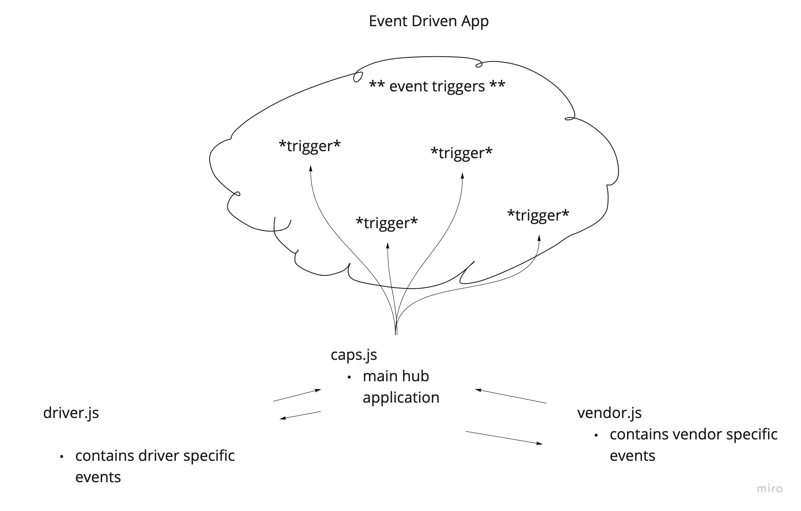

# LAB - Class 12

## Project: Socket.io

### Author: Jenner Dulce

### Links and Resources

- [ci/cd](https://github.com/jennerdulce/Driver/actions) (GitHub Actions)
- [Pull Request](https://github.com/jennerdulce/Driver/pull/1)

### Setup

#### How to initialize/run your application (where applicable)

- `node driver.js`
- npm i
  - socket.io-client@2
  - jest

#### How to use your library (where applicable)

#### Tests

##### Driver.js

- functions should log some output

##### Vendor.js

- functions should log some output

#### UML

;
